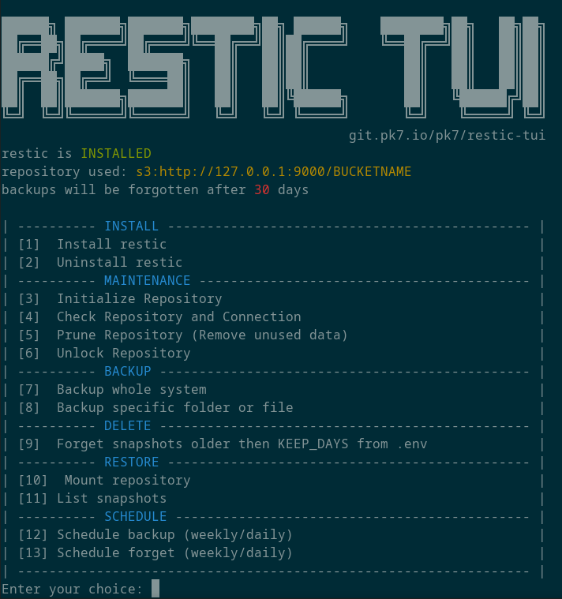

# Restic TUI

<p align="center"></p>

## Table of Content

- [About](#about)
- [Features](#features)
- [Installation](#installation)
- [Usage](#usage)

## About

The  enhances the command-line tool  by providing a **user-friendly** terminal interface. It simplifies the management and interaction with restic backups, making it accessible for all users.

Restic is a popular backup program with strong **encryption** and **deduplication** capabilities, ensuring secure and efficient backups to various destinations. 

It builds upon restic's functionality, offering a graphical interface for common backup operations. Whether you're a system administrator, developer, or everyday user, the restic-tui simplifies restic usage and provides a hassle-free backup management experience. Safeguard your data effortlessly with the !

- Main Repo: `https://gitlab.rechenwerk.com/rechenwerk-gmbh/administration/restic-tui`
- GitHub Mirror: `https://github.com/rechenwerk-GmbH/restic-tui`

## Features

<p></p>

- **Un-/install restic:** Install and uninstall restic.
- **Initialize repository:** Start a fresh repo at the location given in `.env` file.
- **Check repository and connection:** Do an integrity check on the repo. Also checks connection if S3 is used.
- **Prune repository (Remove unused data):** It optimizes the repository by removing unnecessary data, while preserving valid backups.
- **Unlock repository:** If something goes wrong the repo sometimes gets locked. This unlocks it.
- **Backup whole system:** Backup of the whole `/` directory except for `/dev,/media,/mnt,/proc,/run,/sys,/tmp,/var/tmp`.
- **Backup specific folder or file:** Backup single file or directory to the repo.
- **Forget snapshots older then X days:** Deletes snapshots older then `KEEP_DAYS` in `.env` file.
- **Mount repository:** Mount the whole repository at the given path for exploration with file manager. 
- **List snapshots:** ...
- **Schedule backups:** Creates weekly or daily schedule for whole system backups.
- **Schedule forget:** Creates weekly or daily schedule for snapshot-deletion.

## Installation

```bash
curl -O https://raw.githubusercontent.com/pk7x/restic-tui/main/restic-tui.sh
chmod +x restic-tui.sh
sudo ./restic-tui.sh
```

In my opinion, the best place to put this script is at `/home/user/Applications/restic-tui/restic-tui.sh`

## Usage

1. To get the menu just start the script as root. This should also create a `.env` file for you.
2. Edit the `.env` file with your information and credentials.
    - Insert your S3 or MinIO credentials in the `AWS_ACCESS_KEY_ID` and `AWS_SECRET_ACCESS_KEY` variables.
    - In `RESTIC_REPOSITORY` you can use any repository syntax mentioned in  but most common will be the S3 variant or a local path.
    - Choose a secure repo password and put it in `RESTIC_PASSWORD`. ⚠️ **Don't lose it, or your backups will be unaccessible!** ⚠️
    - Change `KEEP_DAYS` to a number of days you usually want to keep your incremental backups.
3. Either install restic with `[1]  Install restic` or do it yourself.
4. Initialize the repository with `[3]  Initialize Repository`.

Now you are ready to use `restic-tui.sh` in any way you would like. Right after I always go for `[7]  Backup whole system` when doing a fresh setup.

### 📌 Startarguments 
> 
> You can also start the script with startarguments, which enables the usage in `crontab` or other scripts, like so:
> 
> ```bash
> # This would execute option 8 on the given file
> sudo ./restic-tui.sh 8 /path/to/file
> 
> # This would prune the repository
> sudo ./restic-tui.sh 5
> ```
